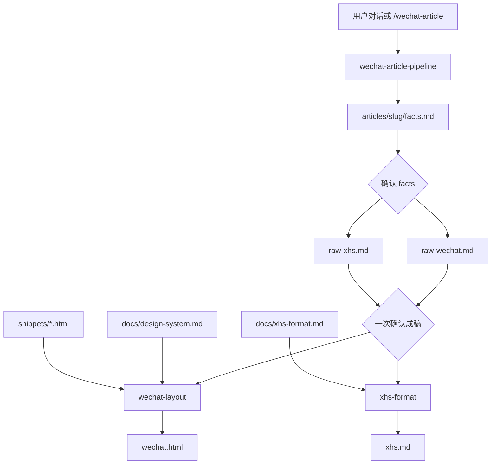

# wechat-article-convertor

在 Cursor 里用**纯 Agent 工作流**把本地项目或网站信息，变成可粘贴到**微信公众号**与/或**小红书**的中文营销稿。v1 **不包含** Next.js/CLI/npm 应用，规范与片段即产品。

## 工作流总览



**两个卡点**：先确认 `facts.md`，再**一次**确认 `raw-wechat.md` 和/或 `raw-xhs.md`，然后才生成平台终稿。

**平台模式**：`/wechat-article` 支持 `微信` | `小红书` | `双平台`（说「同时」默认双平台）。

## 目录说明

| 路径 | 作用 |
|------|------|
| `.cursor/skills/wechat-article-pipeline/` | 编排全流程、平台分支、卡点、交付说明 |
| `.cursor/skills/research-and-draft/` | 调研 → `facts.md` → `raw-wechat.md` / `raw-xhs.md` |
| `.cursor/skills/xhs-draft/` | 小红书成稿规则 |
| `.cursor/skills/xhs-format/` | `raw-xhs.md` → `xhs.md` |
| `.cursor/skills/wechat-layout/` | `raw-wechat.md` → `wechat.html`（含 `reference.md` 映射表） |
| `.cursor/commands/wechat-article.md` | 快捷命令入口（微信 / 小红书 / 双平台） |
| `.cursor/rules/wechat-workflow.mdc` | 编辑 articles/snippets 时的约束 |
| `docs/design-system.md` | 微信设计 token、组件清单、配图语法 |
| `docs/xhs-format.md` | 小红书标题/正文/占位/标签规范 |
| `snippets/*.html` | 可粘贴 HTML 片段，`{{content}}` 占位 |
| `articles/<slug>/` | 每篇文章工作区 |
| `articles/_example/` | 虚构「Markdown转微信」双平台示例 |

## 一次完整使用步骤

### 方式 A：Cursor Command

1. 在 Agent 模式运行 **`/wechat-article`**
2. 按模板提供：**平台**、**本地路径** 和/或 **URL**、各平台受众/语气/字数、可选 `slug`
3. Agent 加载 **wechat-article-pipeline**，产出 `articles/<slug>/facts.md` → **请你确认**
4. 确认后产出 `raw-wechat.md` 和/或 `raw-xhs.md` → **一次确认**
5. 确认后产出 `wechat.html` 和/或 `xhs.md`
6. 微信：复制 `<section>` 内正文到公众号编辑器，按 `IMAGE` 注释上传配图
7. 小红书：复制 `xhs.md` 中标题/正文/标签，按配图清单上传竖图

### 方式 B：自然语言

在 Agent 对话中说：

> 用 wechat-article 工作流，根据 `D:\projects\my-app` **同时**写公众号和小红书，受众开发者，微信专业克制约 1500 字，小红书干货种草约 800 字，配图占位即可。

Agent 应自动应用 pipeline Skill，并遵守双卡点。

### 对照示例

打开 `articles/_example/` 查看标准格式：

- `facts.md` — 事实表
- `raw-wechat.md` — 微信公众号 Markdown 成稿
- `raw-xhs.md` — 小红书笔记成稿
- `wechat.html` — 由 snippets 拼接的可粘贴正文
- `xhs.md` — 小红书发布终稿

## 配图占位语法

**微信**（`raw-wechat.md` / `wechat.html`）：

```html
<!-- IMAGE: {类型描述} | 比例 {如16:9} | 备注 {可选} -->
```

**小红书**（`raw-xhs.md` / `xhs.md` 配图清单）：

```html
<!-- COVER: {封面描述} | 比例 3:4 | 备注 {可选} -->
<!-- IMAGE: {内页描述} | 比例 3:4 | 备注 {可选} -->
```

配图仅占位，不写图片文件；公众号/小红书后台手动上传。

## 向后兼容

旧文章目录若仍使用 `raw.md`，`wechat-layout` 会在缺少 `raw-wechat.md` 时自动回退读取。

## 大仓库可选优化

当本地仓库很大时，pipeline 允许主 Agent **并行**调用内置 `explore`（建议上限 **3 路**），分别扫 `README`、`docs/`、`src/`，再合并为一份 `facts.md`。

- **不**并行写 `raw-*.md` 或平台终稿
- v1 **不**创建 `.cursor/agents/` 自定义 subagent
- **不**默认 Multitask / 后台排版

## v1 明确不做

- Next.js / CLI / npm 运行时
- 自定义 subagent 目录
- 未经确认自动生成 `wechat.html` / `xhs.md`
- GenerateImage 或自动写 `assets/`
- 提交 `.env` 或第三方 API 密钥

## Skills 与规则

项目级 Skills 均设置 `disable-model-invocation: true`，需在对话中**显式**引用 pipeline 或使用 `/wechat-article` 加载。

编辑 `articles/**`、`snippets/**` 或 `docs/design-system.md`、`docs/xhs-format.md` 时，`.cursor/rules/wechat-workflow.mdc` 会自动约束。

## 许可

见 [LICENSE](LICENSE)。
