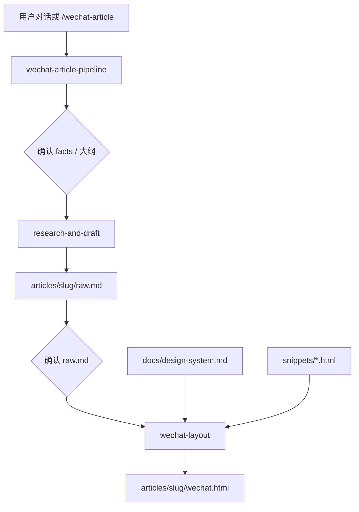

# wechat-article-convertor

在 Cursor 里用**纯 Agent 工作流**把本地项目或网站信息，变成可粘贴到微信公众号的中文营销稿与排版 HTML。v1 **不包含** Next.js/CLI/npm 应用，规范与片段即产品。

## 工作流总览



**两个卡点**：先确认 `facts.md`，再确认 `raw.md`，然后才生成 `wechat.html`。

## 目录说明

| 路径 | 作用 |
|------|------|
| `.cursor/skills/wechat-article-pipeline/` | 编排全流程、卡点、交付说明 |
| `.cursor/skills/research-and-draft/` | 调研 → `facts.md` → `raw.md` |
| `.cursor/skills/wechat-layout/` | `raw.md` → `wechat.html`（含 `reference.md` 映射表） |
| `.cursor/commands/wechat-article.md` | 快捷命令入口 |
| `.cursor/rules/wechat-workflow.mdc` | 编辑 articles/snippets 时的约束 |
| `docs/design-system.md` | 设计 token、组件清单、配图语法、微信限制 |
| `snippets/*.html` | 可粘贴 HTML 片段，`{{content}}` 占位 |
| `articles/<slug>/` | 每篇文章工作区 |
| `articles/_example/` | 虚构「Markdown转微信」示例 trio |

## 一次完整使用步骤

### 方式 A：Cursor Command

1. 在 Agent 模式运行 **`/wechat-article`**（或打开 `.cursor/commands/wechat-article.md` 按提示操作）
2. 按模板提供：**本地路径** 和/或 **URL**、受众、语气、字数、是否 CTA、可选 `slug`、配图策略
3. Agent 加载 **wechat-article-pipeline**，产出 `articles/<slug>/facts.md` → **请你确认**
4. 确认后产出 `raw.md` → **再次确认**
5. 确认后产出 `wechat.html`；打开文件，复制 `<section>` 内正文到公众号编辑器
6. 按文中的 `<!-- IMAGE: ... -->` 在后台上传对应配图

### 方式 B：自然语言

在 Agent 对话中说：

> 用 wechat-article 工作流，根据 `D:\projects\my-app` 写一篇公众号文章，受众是开发者，语气专业克制，约 1500 字，文末加 CTA，配图占位即可。

Agent 应自动应用 pipeline Skill，并遵守双卡点。

### 对照示例

打开 `articles/_example/` 查看标准格式的：

- `facts.md` — 事实表
- `raw.md` — 中文营销 Markdown（含配图占位）
- `wechat.html` — 由 snippets 拼接的可粘贴正文

## 配图占位语法

全文统一：

```html
<!-- IMAGE: {类型描述} | 比例 {如16:9} | 备注 {可选} -->
```

示例：

```html
<!-- IMAGE: 产品主界面截图，左侧 Markdown 右侧预览 | 比例 16:9 | 备注 隐藏用户路径 -->
```

排版阶段保留注释，在公众号编辑器内手动上传图片；默认不使用外链 ``。

## 大仓库可选优化

当本地仓库很大时，pipeline 允许主 Agent **并行**调用内置 `explore`（建议上限 **3 路**），分别扫 `README`、`docs/`、`src/`，再合并为一份 `facts.md`。

- **不**并行写 `raw.md` 或 `wechat.html`
- v1 **不**创建 `.cursor/agents/` 自定义 subagent
- **不**默认 Multitask / 后台排版

## v1 明确不做

- Next.js / CLI / npm 运行时
- 自定义 subagent 目录
- 未经确认自动生成 `wechat.html`
- 提交 `.env` 或第三方 API 密钥

## Skills 与规则

项目级 Skills 均设置 `disable-model-invocation: true`，需在对话中**显式**引用 pipeline 或使用 `/wechat-article` 加载。

编辑 `articles/**`、`snippets/**` 或 `docs/design-system.md` 时，`.cursor/rules/wechat-workflow.mdc` 会自动约束：必须用 snippets、禁止脚本、默认中文。

## 许可

见 [LICENSE](LICENSE)。
